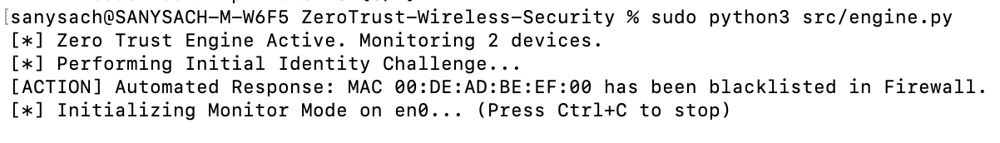

# Zero Trust Wireless Security Engine (802.11)

[](https://opensource.org/licenses/MIT)
[](https://www.python.org/downloads/)

## 🛡️ Project Overview
As an SME in WiFi 7 and 5G, I developed this engine to bridge the gap between traditional wireless connectivity and **Zero Trust Architecture (ZTA)**. This tool moves beyond perimeter-based security by implementing per-packet inspection and automated identity verification at the Data Link Layer.

## 🚀 Key Features
- **Dynamic Identity Verification:** Utilizes a JSON-based "Source of Truth" to validate device MAC addresses in real-time.
- **Automated Threat Mitigation:** Includes a SOAR-inspired module that simulates immediate firewall blacklisting (iptables) upon detection of De-authentication attacks.
- **Wireless Forensic Logging:** Generates audit-ready logs for ingestion into SIEM tools like Splunk or Grafana.
- **Protocol Depth:** Targeted detection for Layer 2 vulnerabilities, specifically unauthorized SSID association and management frame manipulation.

## 🏗️ System Architecture
1. **Ingestion:** Scapy sniffer captures 802.11 management frames in monitor mode.
2. **Analysis:** Logic engine compares frame metadata against `authorized_devices.json`.
3. **Response:** If the `TrustScore` falls below the threshold, the `block_malicious_actor` module triggers an alert.

## 📸 Demo
 ## 🛠️ Installation & Usage
```bash
# Clone the repo
git clone [https://github.com/sanyasachdeva1/ZeroTrust-Wireless-Security.git](https://github.com/sanyasachdeva1/ZeroTrust-Wireless-Security.git)

# Install dependencies
pip install -r requirements.txt

# Run in monitor mode (Requires Root)
sudo python3 src/engine.py
