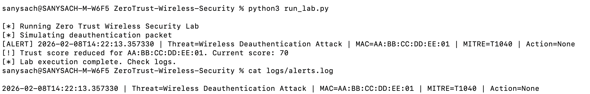

# Wireless Zero Trust Threat Detection & Response Lab

This project implements a Python-based wireless security lab that applies **Zero Trust principles**
to detect, evaluate, and respond to malicious activity in **802.11 (Wi-Fi) networks**.

The system demonstrates how modern enterprise wireless security combines **identity-based trust,
continuous verification, threat detection, and automated incident response**, similar to real-world
SOC and Zero Trust environments.

---

## Key Features

- Real-time 802.11 wireless packet inspection using **Scapy**
- **Identity-first Zero Trust model** with dynamic trust scoring per device
- Detection of **wireless deauthentication attacks**
- Threat detection mapped to the **MITRE ATT&CK framework**
- **Automated SOAR-style incident response** for compromised devices
- **SIEM-compatible security logging** for SOC visibility

---

## Architecture Overview
The system follows a complete blue-team security pipeline:
1. **Packet Capture**  
   Wireless frames are captured and inspected in real time.
2. **Attack Detection**  
   802.11 management frames are analyzed to identify deauthentication attacks.
3. **Zero Trust Evaluation**  
   Each device maintains a dynamic trust score that degrades on malicious behavior.
4. **Automated Response**  
   Devices that breach trust thresholds are automatically isolated.
5. **Centralized Logging**  
   Security events are logged in a SIEM-compatible format for monitoring and analysis.

---

## MITRE ATT&CK Mapping
| Attack Type                  | Technique ID | Description                               |
|-----------------------------|--------------|-------------------------------------------|
| Deauthentication Attack     | T1040        | Network Sniffing / Traffic Interception   |

---

## Use Cases

- Enterprise wireless intrusion detection
- Zero Trust enforcement in Wi-Fi networks
- SOC analyst training and blue-team simulations
- Security automation and incident response demonstrations

---

## Technologies Used

- Python
- Scapy
- Zero Trust Architecture
- MITRE ATT&CK Framework
- SIEM / SOC Logging Concepts

---
## Lab Demonstration (Verified Execution)

The Zero Trust pipeline was executed locally using a controlled simulation
to validate end-to-end detection, trust evaluation, and response.

### Command Used
python3 run_lab.py

### Observed Output
 

This output demonstrates:
- Real detection of a wireless deauthentication event
- Dynamic trust score degradation (Zero Trust enforcement)
- Automated incident response trigger
- SIEM-compatible alert generation

---

## Disclaimer

This project is designed for educational and defensive security purposes only.
Attack simulations are non-destructive and do not transmit real malicious traffic.

