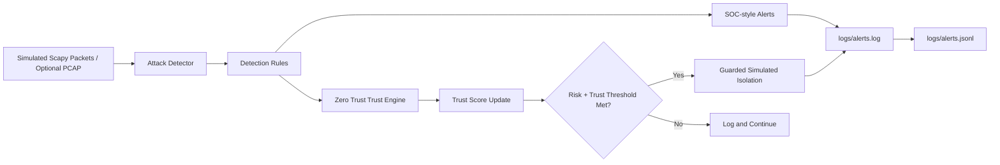

# Wireless Zero Trust Detection & Response Lab

[](https://opensource.org/licenses/MIT)
[](https://www.python.org/downloads/)
[](https://github.com/sanyasachdeva1/ZeroTrust-Wireless-Security/actions/workflows/python-check.yml)

Defensive wireless security lab that detects suspicious 802.11 Wi-Fi activity using Python, Scapy, configurable detection rules, and Zero Trust response logic.
The lab safely simulates wireless events in memory and logs SOC-style alerts without transmitting attack traffic.
> Built to connect enterprise wireless networking experience with blue-team detection engineering.

## Why I Built This
I built this project to bridge enterprise wireless networking and cybersecurity detection engineering.
The goal was to show how suspicious Wi-Fi behavior can be detected, scored, logged, and mapped to a Zero Trust response workflow in a safe lab environment.

## What It Detects

| Detection | Purpose |
|---|---|
| Deauthentication flood | Identify possible wireless disruption behavior |
| Unknown wireless device | Flag untrusted MAC addresses |
| Evil twin AP | Detect suspicious SSID/BSSID mismatch behavior |
| Beacon flood | Identify abnormal beacon activity |
| Probe requests | Log suspicious discovery behavior |
| Trust-score changes | Reduce trust based on suspicious activity |
| Simulated isolation | Log guarded containment decisions |

## How It Works

1. Simulated packets or offline PCAP packets are sent to the detector.
2. Detection rules are loaded from `config/detection_rules.json`.
3. Trusted devices and SSID/BSSID expectations are loaded from `config/trusted_devices.json`.
4. Alerts are written to `logs/alerts.log` and `logs/alerts.jsonl`.
5. Suspicious trusted devices lose trust score.
6. If risk and trust thresholds allow it, simulated containment is logged.

## Architecture


```mermaid
flowchart LR
    A[Simulated Scapy Packets / Optional PCAP] --> B[Attack Detector]
    B --> C[Detection Rules]
    C --> D[SOC-style Alerts]
    C --> E[Zero Trust Trust Engine]
    E --> F[Trust Score Update]
    F --> G{Risk + Trust Threshold Met?}
    G -->|Yes| H[Guarded Simulated Isolation]
    G -->|No| I[Log and Continue]
    H --> J[logs/alerts.log]
    D --> J
    J --> K[logs/alerts.jsonl]
```

## Real-World Mapping

In a production wireless environment, this workflow could map to:

- Wireless LAN Controller telemetry
- Cisco ISE / NAC policy decisions
- Rogue AP and client behavior monitoring
- SIEM alert ingestion
- SOAR response approval
- Identity-aware quarantine workflows

## What Makes This Different
This project is intentionally built as a defensive blue-team lab, not a wireless attack toolkit. Instead of focusing on exploitation, it shows how wireless signals can flow through detection rules, risk scoring, SOC-style logging, trust-score reduction, and guarded simulated response.
It is small by design: configurable enough to demonstrate real security thinking, but simple enough to read, test, and explain.


## Run The Lab

```bash
pip install -r requirements.txt
python3 run_lab.py
```

View alerts:

```bash
cat logs/alerts.log
cat logs/alerts.jsonl
```

## Optional PCAP Analysis

```bash
python3 src/pcap_analyzer.py --pcap path/to/wireless_capture.pcap
```

Try the small included sample:

```bash
python3 src/pcap_analyzer.py --pcap sample-data/wireless_lab_sample.pcap
```

The analyzer also handles non-wireless PCAPs and reports when no 802.11 frames are present. Only analyze captures you are authorized to use.

## Tests

```bash
pip install -r requirements-dev.txt
pytest
```

## Configuration

Detection thresholds, severities, and cooldowns live in:

```text
config/detection_rules.json
```

Trusted devices, trusted SSID/BSSID expectations, trust penalties, and response safety controls live in:

```text
config/trusted_devices.json
```

## Resume Relevance

This project demonstrates hands-on experience with:

- Wireless security detection concepts
- Python and Scapy-based packet simulation
- Zero Trust trust scoring
- SOC-style alert logging
- Detection rules and threshold tuning
- Network security response workflow design

## Notes

This is a lab project, not a production wireless IDS. MAC addresses can be spoofed, thresholds need tuning, and real deployments should combine this kind of logic with controller telemetry, NAC identity, SIEM correlation, and RF context.

## Safety

This project is for educational and defensive use only. Test only on systems and networks you own or have permission to assess.
