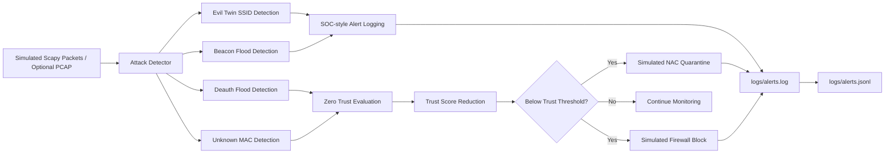
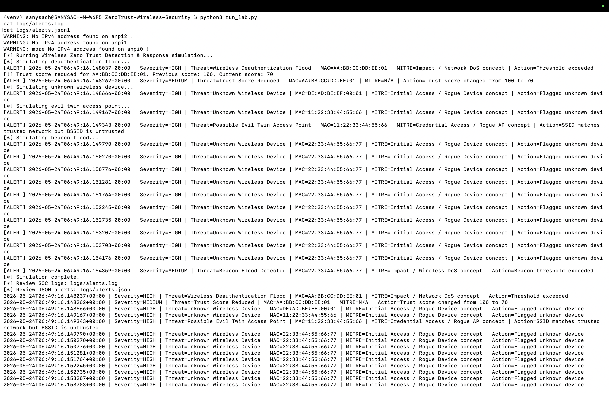
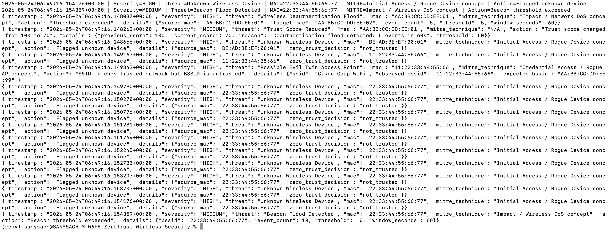

# Wireless Zero Trust Threat Detection & Response Lab

[](https://opensource.org/licenses/MIT)
[](https://www.python.org/downloads/)
[](https://github.com/sanyasachdeva1/ZeroTrust-Wireless-Security/actions/workflows/python-check.yml)

This project implements a Python-based wireless security lab that applies **Zero Trust principles** to detect, evaluate, and respond to suspicious activity in **802.11 Wi-Fi networks**.

The lab demonstrates how enterprise wireless security can combine **identity-based trust, continuous verification, wireless threat detection, SOC-style logging, structured JSON alerts, and simulated incident response**.

---

## Key Features

- Safe local simulation of wireless attack scenarios using **Scapy**
- Detection of **802.11 deauthentication flood** activity
- **Unknown MAC detection** using trusted device inventory
- **Evil Twin SSID detection** using trusted SSID/BSSID mapping
- **Beacon flood detection** using rate-based thresholds
- Identity-first **Zero Trust trust scoring**
- Simulated **NAC quarantine** and **firewall block** response
- SOC-style alert logging in `logs/alerts.log`
- Structured JSONL alert generation in `logs/alerts.jsonl`
- Optional offline PCAP analysis using `src/pcap_analyzer.py`
- Automated tests using `pytest`
- GitHub Actions CI workflow for syntax checks and test execution
- Detection thresholds managed through `config/detection_rules.json`
- Sample SOC and JSONL outputs available in `sample-output/`

---

## Architecture Overview

The system follows a blue-team wireless detection and response pipeline:

1. Simulated Scapy packets or optional PCAP input are processed.
2. The attack detector evaluates wireless activity for multiple suspicious patterns.
3. Detection events are written to SOC-style logs and structured JSONL alerts.
4. The Zero Trust engine checks device inventory and reduces trust score when suspicious behavior is observed.
5. If the trust score drops below the configured policy threshold, simulated containment is triggered.
6. Response actions include simulated NAC quarantine and firewall blocking.

### Architecture Flow


```mermaid
flowchart LR
    A[Simulated Scapy Packets / Optional PCAP] --> B[Attack Detector]
    B --> C[Deauth Flood Detection]
    B --> D[Unknown MAC Detection]
    B --> E[Evil Twin SSID Detection]
    B --> F[Beacon Flood Detection]

    C --> G[Zero Trust Evaluation]
    D --> G
    E --> H[SOC-style Alert Logging]
    F --> H

    G --> I[Trust Score Reduction]
    I --> J{Below Trust Threshold?}
    J -->|Yes| K[Simulated NAC Quarantine]
    J -->|Yes| L[Simulated Firewall Block]
    J -->|No| M[Continue Monitoring]

    H --> N[logs/alerts.log]
    K --> N
    L --> N
    N --> O[logs/alerts.jsonl]
```

---

## MITRE ATT&CK Mapping

| Detection | Tactic / Concept | Why it matters |
|---|---|---|
| 802.11 Deauthentication Flood | Impact / Network Denial of Service concept | Repeated deauthentication frames can disrupt wireless availability by forcing clients to disconnect |
| Unknown Wireless Device | Initial Access / Rogue Device concept | A device not present in the trusted inventory violates Zero Trust access assumptions |
| Evil Twin SSID | Credential Access / Rogue Access Point concept | A malicious AP imitating a trusted SSID can trick users into connecting and expose credentials or traffic |
| Beacon Flood | Impact / Wireless DoS concept | Excessive beacon frames can create noise, degrade visibility, and disrupt normal wireless operations |
| Trust Score Degradation | Continuous Verification / Policy Enforcement concept | Repeated suspicious behavior lowers device trust and can trigger containment |

---

## Use Cases

- Enterprise wireless intrusion detection lab
- Zero Trust enforcement simulation in Wi-Fi environments
- SOC analyst training and blue-team simulation
- Wireless threat detection engineering practice
- Security automation and incident response demonstration
- Network security portfolio project

---

## Technologies Used

- Python
- Scapy
- 802.11 wireless security concepts
- Zero Trust Architecture
- Trusted device inventory
- Trust scoring
- SOC-style logging
- JSONL structured alerts
- Optional PCAP analysis
- Pytest
- GitHub Actions

---

## Lab Demonstration

The Zero Trust pipeline can be executed locally using safe Scapy-based simulations.

The simulation does **not** transmit real wireless attack traffic. It creates in-memory 802.11 packet objects and sends them through the detection pipeline.

### Command Used

```bash
python3 run_lab.py
```

### Observed Output




The latest demo run shows the complete wireless detection and response workflow:

- Deauthentication flood detection
- Unknown MAC detection
- Evil Twin SSID detection
- Beacon flood detection
- Trust score reduction based on suspicious behavior
- Simulated NAC quarantine and firewall block response
- SOC-style alert generation in `logs/alerts.log`
- Structured JSONL alert generation in `logs/alerts.jsonl`

### Sample SOC Alert

```text
Severity=HIGH | Threat=Wireless Deauthentication Flood | MAC=AA:BB:CC:DD:EE:01 | MITRE=Impact / Network DoS concept | Action=Threshold exceeded
```

### Sample JSONL Alert

```json
{
  "severity": "HIGH",
  "threat": "Wireless Deauthentication Flood",
  "mac": "AA:BB:CC:DD:EE:01",
  "mitre_technique": "Impact / Network DoS concept",
  "action": "Threshold exceeded"
}
```

---

## Running the Lab

### 1. Clone the repository

```bash
git clone https://github.com/sanyasachdeva1/ZeroTrust-Wireless-Security.git
cd ZeroTrust-Wireless-Security
```

### 2. Install dependencies

```bash
pip install -r requirements.txt
```

### 3. Run the safe simulation

```bash
python3 run_lab.py
```

### 4. View generated SOC-style logs

```bash
cat logs/alerts.log
```

### 5. View structured JSONL alerts

```bash
cat logs/alerts.jsonl
```

### 6. View sample outputs

```bash
cat sample-output/alerts_sample.log
cat sample-output/alerts_sample.jsonl
```

---

## Optional: Run the Attack Simulation Directly

```bash
python3 attacks/simulate_deauth.py
```

---

## Optional: Analyze a PCAP File

The project also supports offline packet analysis using Scapy’s `rdpcap`.

```bash
python3 src/pcap_analyzer.py --pcap sample-data/wireless_sample.pcap
```

This allows the detection engine to process captured packets instead of only simulated packets.

> Note: This repository does not include a sample PCAP file yet. Add your own authorized wireless capture file before using this command.

---

## Tests and CI

Run local tests:

```bash
pytest
```

This project uses GitHub Actions to validate Python syntax and run automated tests on every push and pull request.

---

## Sample Incident Report

A sample incident report is available at:

```bash
reports/sample_incident_report.md
```

The report documents a simulated wireless deauthentication flood, Zero Trust trust-score decisioning, and simulated containment actions.

---
## Detection Logic Documentation

Detailed detection logic, false positive notes, and tuning guidance are available at:

```bash
docs/detection_logic.md
```

---

## Real-World Mapping

In a production wireless security environment, this workflow could map to:

- Cisco ISE for NAC quarantine
- Wireless LAN Controller logs for client and AP behavior
- SIEM ingestion for JSONL alerts
- SOAR workflow for containment
- Firewall policy updates for blocking suspicious devices
- PCAP analysis for incident investigation

---

## Disclaimer

This project is designed for educational and defensive security purposes only. The simulation is non-destructive and does not transmit real malicious wireless traffic.

Only run wireless security testing on networks and devices you own or are authorized to test.
