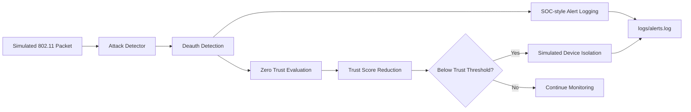
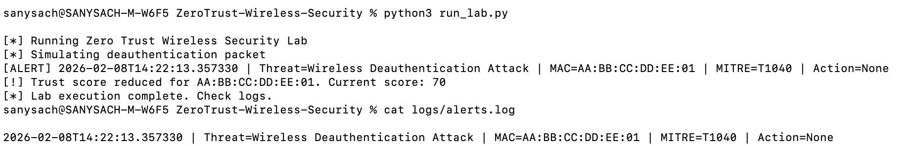

# Wireless Zero Trust Threat Detection & Response Lab

[](https://opensource.org/licenses/MIT)
[](https://www.python.org/downloads/)
[](https://github.com/sanyasachdeva1/ZeroTrust-Wireless-Security/actions/workflows/python-check.yml)

This project implements a Python-based wireless security lab that applies **Zero Trust principles** to detect, evaluate, and respond to suspicious activity in **802.11 Wi-Fi networks**.

The lab demonstrates how enterprise wireless security can combine **identity-based trust, continuous verification, threat detection, SOC-style logging, and simulated incident response**.

---

## Key Features

- Safe local simulation of wireless attack scenarios using Scapy
- Detection of 802.11 deauthentication flood activity
- Unknown MAC detection using trusted device inventory
- Evil Twin SSID detection using trusted SSID/BSSID mapping
- Beacon flood detection using rate-based thresholds
- Identity-first Zero Trust model with dynamic trust scoring
- Simulated NAC quarantine and firewall block response
- SOC-style alert logging in `logs/alerts.log`
- Structured JSONL alert generation in `logs/alerts.jsonl`
- Optional PCAP analysis using `src/pcap_analyzer.py`
- Basic tests and GitHub Actions CI workflow

---

## Architecture Overview

The system follows a simple blue-team security pipeline:

1. A simulated 802.11 deauthentication packet is generated.
2. The attack detector identifies suspicious wireless behavior.
3. A SOC-style alert is written to `logs/alerts.log`.
4. The Zero Trust engine reduces the device trust score.
5. If the trust score drops below the configured threshold, device isolation is simulated.

### Architecture Flow


```mermaid
flowchart LR
    A[Simulated 802.11 Packet] --> B[Attack Detector]
    B --> C[Deauth Detection]
    C --> D[SOC-style Alert Logging]
    C --> E[Zero Trust Evaluation]
    E --> F[Trust Score Reduction]
    F --> G{Below Trust Threshold?}
    G -->|Yes| H[Simulated Device Isolation]
    G -->|No| I[Continue Monitoring]
    H --> J[logs/alerts.log]
    D --> J
```

---

## MITRE ATT&CK Mapping

| Detection | Tactic / Concept | Why it matters |
|---|---|---|
| 802.11 Deauthentication Attack | Impact / Network Denial of Service concept | Deauth frames can force wireless clients to disconnect and disrupt availability |
| Unknown Wireless Device | Initial Access / Rogue Device concept | Unknown devices violate identity-based trust assumptions |
| Trust Score Degradation | Continuous Verification Failure | Repeated suspicious behavior lowers device trust and can trigger response |

---

## Use Cases

- Enterprise wireless intrusion detection lab
- Zero Trust enforcement simulation in Wi-Fi environments
- SOC analyst training and blue-team simulation
- Security automation and incident response demonstration
- Network security portfolio project

---

## Technologies Used

- Python
- Scapy
- 802.11 wireless security concepts
- Zero Trust Architecture
- SOC-style logging
- Incident response simulation

---

## Lab Demonstration

The Zero Trust pipeline can be executed locally using a safe Scapy-based simulation.

The simulation does **not** transmit real wireless attack traffic. It creates an in-memory 802.11 deauthentication packet and sends it through the detection pipeline.

### Command Used

```bash
python3 run_lab.py
```

### Observed Output



This output demonstrates:

- Safe simulation of a wireless deauthentication event
- Detection of suspicious 802.11 management frame behavior
- Trust score reduction for the suspicious device
- Simulated isolation workflow when trust falls below threshold
- SOC-style alert generation in `logs/alerts.log`

---

## Running the Lab

### 1. Clone the repository

```bash
git clone https://github.com/sanyasachdeva1/ZeroTrust-Wireless-Security.git
cd ZeroTrust-Wireless-Security
```

### 2. Install dependencies

```bash
pip install -r requirements.txt
```

### 3. Run the safe simulation

```bash
python3 run_lab.py
```

### 4. View generated alerts

```bash
cat logs/alerts.log
cat logs/alerts.jsonl
```

### Optional: Run the attack simulation directly

```bash
python3 attacks/simulate_deauth.py
```

```md
## Optional: Analyze a PCAP File

The project also supports offline packet analysis using Scapy’s `rdpcap`.

```bash
python3 src/pcap_analyzer.py --pcap sample-data/wireless_sample.pcap

---

## Disclaimer

This project is designed for educational and defensive security purposes only. The simulation is non-destructive and does not transmit real malicious wireless traffic.

Only run wireless security testing on networks and devices you own or are authorized to test.
